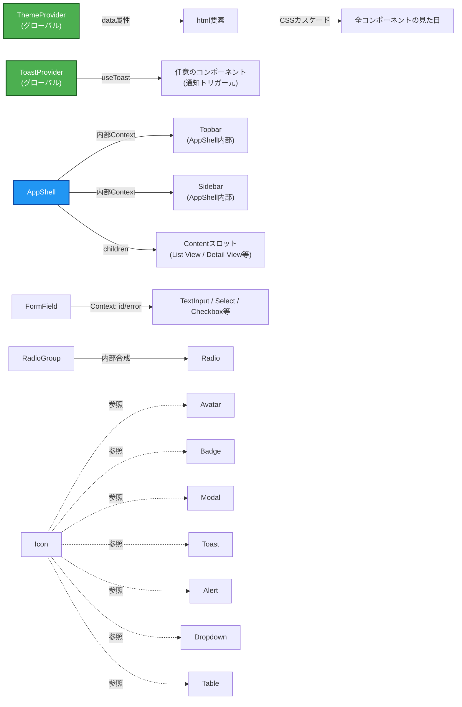

# コンポーネント依存関係・通信パターン

## 依存関係マトリクス

| コンポーネント | 依存先 | 依存理由 |
|---|---|---|
| Avatar | Icon(任意) | 画像なし時のフォールバック表示でアイコンを使う場合がある |
| Badge | Icon(任意) | アイコン付きBadgeの場合 |
| Tooltip | Icon(任意) | トリガーがアイコンボタンの場合が多い(依存ではなく利用パターン) |
| Modal | Icon | ヘッダーの閉じるボタン |
| Toast | Icon | variant別アイコン表示 |
| Alert | Icon | variant別アイコン表示 |
| Dropdown/Menu | Icon | シェブロン・メニュー項目アイコン |
| Tabs | Icon(任意) | タブにアイコンを付ける場合 |
| Table | Checkbox, Icon | 行選択チェックボックス、ソート矢印アイコン |
| TextInput / Textarea / Select / Checkbox / Radio / Switch | FormField(Context経由、任意) | `FormField`配下で使われた場合、id/aria-describedbyを自動取得 |
| RadioGroup | Radio | 内部実装として個々のRadioを描画 |
| AppShell | Icon, Badge, Avatar, Dropdown/Menu | Sidebarナビアイコン、Topbar通知件数(Badge)、ユーザーメニュー(Avatar+Dropdown) |
| AppShell | ThemeProvider(独立、任意) | 併用は可能だが直接依存はしない |

依存のない独立コンポーネント: Button, Card, ThemeProvider, ToastProvider

## 通信パターン

1. **Context経由の暗黙連携**(サービス層): ThemeProvider→CSS(data属性経由、Reactツリーを介さない)、ToastProvider→`useToast()`、AppShell内部Context→`useAppShell()`。いずれもContext Providerのサブツリー内でのみ有効
2. **Context経由のコンポーネント間連携**: FormField→内側のInput系コンポーネント(id/エラー状態)。Question 6=Aの方針による
3. **Props経由の明示的連携**(大多数のコンポーネント): Table, Tabs, Dropdown/Menu, RadioGroup, AppShellのnavItems等、Question 1=Bの方針により`items`/`data`等の配列propsでデータを渡す
4. **合成(Composition)**: RadioGroupがRadioを内部合成、AppShellがSidebar/Topbar/Content領域を内部合成(Sidebar/Topbarは独立コンポーネントとしては公開しない、要件定義書FR1参照)

## データフロー図



### テキスト代替

```
ThemeProvider(グローバル) → html要素のdata属性 → CSSカスケードで全コンポーネントの見た目に反映
ToastProvider(グローバル) → useToast()経由で任意のコンポーネントから通知をトリガー
AppShell → 内部Contextで Topbar/Sidebar と状態共有、children(Contentスロット)に画面パターンを描画
FormField → Context経由で内側のInput系コンポーネントにid/エラー状態を伝達
RadioGroup → 内部でRadioを合成
Icon → Avatar/Badge/Modal/Toast/Alert/Dropdown/Table等から参照される共通プリミティブ
```
