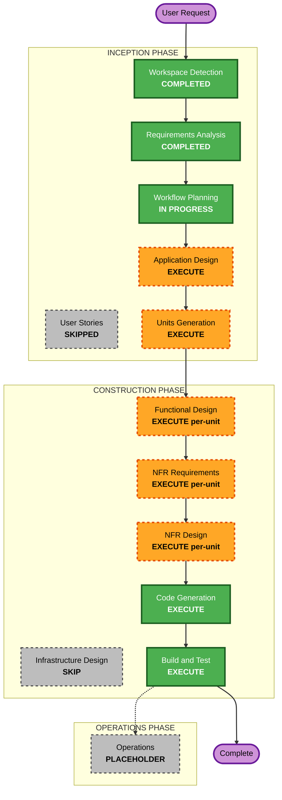

# Execution Plan — Web UI デザインシステム

## Detailed Analysis Summary

### Change Impact Assessment

- **User-facing changes**: Yes(間接的) — 本プロジェクト自体はエンドユーザー向けアプリではないが、他プロジェクト(MasterMeister等)がこのコンポーネント群を使ってエンドユーザー向けUIを構築するため、コンポーネントのa11y・挙動品質がエンドユーザー体験に直結する
- **Structural changes**: N/A(Greenfieldのため既存構造なし)
- **Data model changes**: No(バックエンド・永続データを持たないUIコンポーネントライブラリ)
- **API changes**: Yes — 十数種類のコンポーネントのProps/メソッド/依存関係というAPI設計そのものが本プロジェクトの中心課題
- **NFR impact**: Yes — a11y(WCAG 2.1 AA)、レスポンシブ(デスクトップのみ)、ブラウザ対応、テスト(単体+a11y自動+PBT Partial)が定義済み

### Risk Assessment

- **Risk Level**: Medium — 技術的難易度よりも**スコープの広さ**(十数コンポーネント+4画面パターン+テーマ4軸+React版/HTML版の二重実装+組み込みガイド)と、二重成果物間の実装ロジック整合が主なリスク要因。プロトタイプ位置づけのため本番運用リスクは低い
- **Rollback Complexity**: Easy(Greenfieldプロトタイプ、本番デプロイなし)
- **Testing Complexity**: Moderate〜Complex(a11y自動テスト、PBT Partial、Table等の複雑な状態管理を含む)

## Workflow Visualization



### テキスト代替(Mermaid非対応環境向け)

```
INCEPTION PHASE
- Workspace Detection: COMPLETED
- Requirements Analysis: COMPLETED
- User Stories: SKIPPED
- Workflow Planning: IN PROGRESS(本ドキュメント)
- Application Design: EXECUTE
- Units Generation: EXECUTE

CONSTRUCTION PHASE(ユニットごとに繰り返し)
- Functional Design: EXECUTE(ユニット単位で要否判定)
- NFR Requirements: EXECUTE(ユニット単位で要否判定)
- NFR Design: EXECUTE(ユニット単位で要否判定)
- Infrastructure Design: SKIP(インフラを持たないため全ユニット非該当)
- Code Generation: EXECUTE(常に実行)
- Build and Test: EXECUTE(常に実行)

OPERATIONS PHASE
- Operations: PLACEHOLDER
```

## Phases to Execute

### 🔵 INCEPTION PHASE

- [x] Workspace Detection (COMPLETED)
- [x] Requirements Analysis (COMPLETED)
- [x] User Stories (SKIPPED)
  - **Rationale**: エンドユーザー向けの業務要件・複数ペルソナを持たない開発者向けコンポーネントライブラリであり、要件定義書(FR/NFR)で機能・API仕様が十分に具体化されているため
- [x] Execution Plan (IN PROGRESS — 本ドキュメント)
- [ ] Application Design - **EXECUTE**
  - **Rationale**: 十数種類の新規コンポーネントについて、Props/メソッドのAPI、コンポーネント間依存関係(例: Icon ← Avatar/Badge/Tooltip/AppShell、FormField ← TextInput/Textarea/Select/Checkbox/Radio/Switch、AppShellがSidebar/Topbarを内包 等)を明確化する必要があるため
- [ ] Units Generation - **EXECUTE**
  - **Rationale**: requirements.mdのリスク欄でも指摘した通りスコープが広範(十数コンポーネント+4画面パターン+テーマ4軸+React版/HTML版二重実装+組み込みガイド)であり、実装単位への分割が不可欠なため

### 🟢 CONSTRUCTION PHASE(ユニットごとの繰り返し)

- [ ] Functional Design - **EXECUTE(ユニット単位で要否判定)**
  - **Rationale**: Table(ソート/ページネーション/行選択/列幅調整/インライン編集)、Toast/Modal/AppShell/Dropdown/Tabs等の状態管理を伴うユニットで詳細設計が必要。Icon/Badge等の静的なユニットではスキップ判定になる見込み
- [ ] NFR Requirements - **EXECUTE(ユニット単位で要否判定)**
  - **Rationale**: 単体テストフレームワーク(Vitest等)、a11y自動テストツール(axe系)、PBTフレームワーク(fast-check、Partial適用)の選定をユニット横断で確定する必要があるため
- [ ] NFR Design - **EXECUTE(ユニット単位で要否判定)**
  - **Rationale**: フォーカストラップ・aria-live・focus-visible等のa11yパターンを、該当ユニットの設計に組み込むため
- [ ] Infrastructure Design - **SKIP**
  - **Rationale**: バックエンド・クラウドインフラを持たないフロントエンドコンポーネントライブラリであり、全ユニットで非該当
- [ ] Code Generation - EXECUTE (ALWAYS)
  - **Rationale**: 各ユニットの実装計画立案とコード生成
- [ ] Build and Test - EXECUTE (ALWAYS)
  - **Rationale**: 全ユニット完了後のビルド・単体テスト・a11yテスト実行

### 🟡 OPERATIONS PHASE

- [ ] Operations - PLACEHOLDER
  - **Rationale**: 将来のデプロイ・監視ワークフロー用のプレースホルダー(本プロジェクトはプロトタイプのため現時点では非該当)

## Estimated Timeline

- **Total Stages**: 8(Application Design, Units Generation, 各ユニットのFunctional Design/NFR Requirements/NFR Design/Code Generation、Build and Test)
- **Estimated Duration**: ユニット数・粒度はUnits Generationステージで確定

## Success Criteria

- **Primary Goal**: requirements.mdのFR1〜FR8・NFR1〜NFR9を満たすWeb UIデザインシステム(React+TypeScript版、Node.js不要のHTML版、組み込みガイド)を完成させる
- **Key Deliverables**:
  - Reactコンポーネント一式(十数種類)+ 4画面パターン + テーマ機能4軸
  - Node.js不要のHTML+CSS(+JS)静的デモ版(全対象)
  - 他プロジェクトへの組み込みガイド
  - 単体テスト + a11y自動テスト(+ PBT Partial対象範囲)
- **Quality Gates**: WCAG 2.1 AA準拠、モダンブラウザ最新2バージョン対応、デスクトップ幅でのレスポンシブ崩れなし
